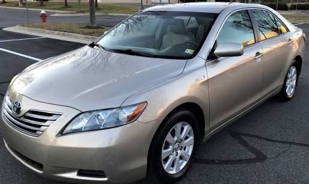
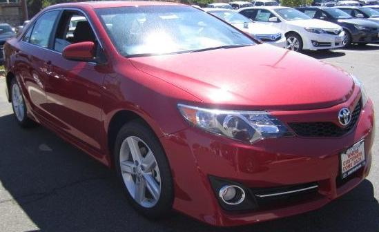

# Using Computer Vision for Home Security
This project explores the possibility of using computer vision to detect unknown cars with minimal data. It is seeking to answer the following questions:

1. Can a model with minimal data be used to detect unknow cars?
2. Can this model be trained with photographs taken by an average person?

## Data
**Known car:** A car was found on the sales section of craigslist. In the advertisement, 8 photographs were identified to train the model. They consisted of photos from the front, rear, sides, and at an angle.

**Unknown cars:** 57 photos were extracted from the Stanford car dataset that can be found [here]( https://ai.stanford.edu/~jkrause/cars/car_dataset.html). The photos were chosen because of similarities to the known car. However, some not so similar cars were chosen too. These cars were sedans but were different colors or the shape was not similar.  
  
The following modifications were performed to the dataset:
-	Data augmentation was performed on the training set in the form of random brightness adjustments.
-	All data was resized to 256x256.
-	All data was cropped down to the car only.

**Known Car**

**Unknown Car**

## Approach
This model assumes that the car that needs to be recognized will be in the same exact angle every time. This assumption comes from the idea that a security camera is fixed to a structure and does not move. The car may be parked in different positions, but the 8 photos should capture all the possible angles. Another assumption made is that the car will be in full view of the camera.

## Results
Due to the stochastic nature of neural networks, different results were achieved. Sometimes these results were extreme. However, this project still showed promising results in training a model with minimal data. The photos provided were of an average car taken by an average person. Therefore, we can assume that this can be done as well.

## Future Work
-	Object detection can be used to find cars in the photo/video, and the exact area of the object can be extracted for analysis. This would ensure that the data is crop down like in this project. Constrains can be applied that way the computer is trying to find objects in a specific area. 
-	After cropping down the image, an approach can be taken to find the dominant color of the data. If the color is extremely different, it can be flagged as an unknow car.
-	A feedback loop can be created to allow the model to train continuously. 
-	The model should be trained with other specific cars such as SUVs, pickup-trucks, etc. to measure its performance. 